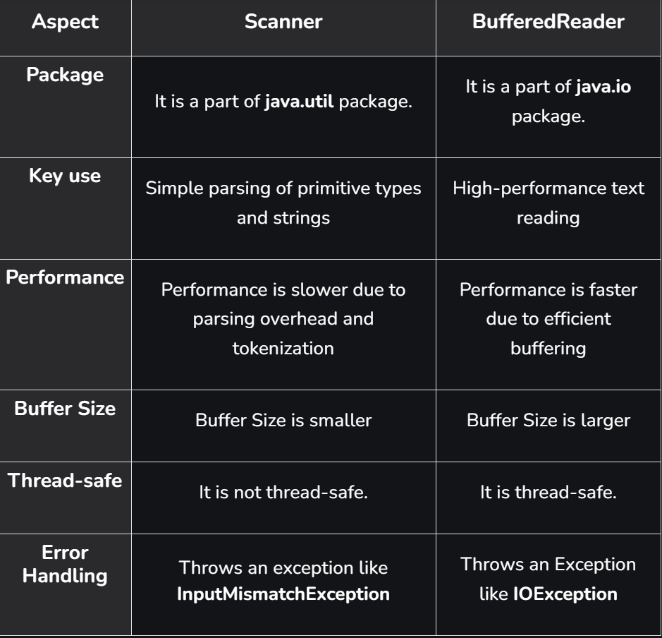

#### 1. Compile the file using:
javac FileName.java
This creates class files for all classes in that file.

## 2. Run the program using:
java ClassName
Write only the class name that contains the main method.
Do not write .java or .class.

## Rules for compilation:
1. If a class is declared public, the file name must be exactly the same as the public class name.
2. If there is no public class, the file name can be anything (but it is better to keep it same as the main class name).
Only one public class is allowed in a single Java file.

## Datatype in java
Non Primitive- Integer, Float, Character, Boolean
Primitive- Byte (1), Short(2), int(4), long(8), float(4), double(8)

double is by default type to decimal values and int is default type of integer number. 
for float --> float x = 5.6f;
for long --> long x = 6l;

